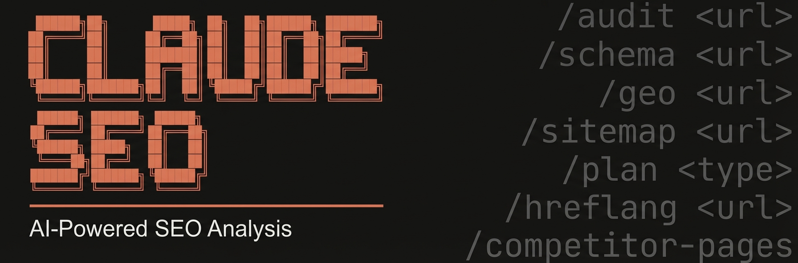

<!-- Updated: 2026-04-27 -->



> **Note:** This is **Claude Next SEO** - an enhanced fork of [Claude SEO](https://github.com/AgriciDaniel/claude-seo) with multi-client management, WordPress integration, and automated image optimization workflows.

# Claude Next SEO - Multi-Client SEO Management for Claude Code

Professional SEO analysis and management tool for agencies and consultants. Built on Claude SEO with added enterprise features: **multi-client/project management**, **WordPress REST API integration**, **automated image SEO workflow** with cannibalization prevention, and organized report storage.

**Core Features:** 20+ sub-skills covering technical SEO, on-page analysis, content quality (E-E-A-T), schema markup, image optimization, sitemap architecture, AI search optimization (GEO), local SEO, maps intelligence, semantic topic clustering, search experience optimization (SXO), SEO drift monitoring, e-commerce SEO, international SEO, Google SEO APIs (Search Console, PageSpeed, CrUX, GA4), PDF report generation, and strategic planning.

**New in Next SEO:** Client/project organization, WordPress upload automation, interactive image workflow with checkpoint confirmations, and SQLite-based tracking.


[](https://claude.ai/claude-code)
[](LICENSE)
[](https://github.com/AgriciDaniel/claude-seo)
[](https://github.com/AgriciDaniel/claude-seo)

## Table of Contents

- [Installation](#installation)
- [Quick Start](#quick-start)
- [Commands](#commands)
- [Features](#features)
- [Architecture](#architecture)
- [Extensions](#extensions)
- [Ecosystem](#ecosystem)
- [Documentation](#documentation)
- [Requirements](#requirements)
- [Uninstall](#uninstall)
- [Contributing](#contributing)

## Installation

### Plugin Install (Claude Code 1.0.33+)

```bash
# Add marketplace (one-time)
/plugin marketplace add AgriciDaniel/claude-seo

# Install plugin
/plugin install claude-seo@AgriciDaniel-claude-seo
```

### Manual Install (Unix/macOS/Linux)

```bash
git clone --depth 1 https://github.com/AgriciDaniel/claude-seo.git
bash claude-seo/install.sh
```

<details>
<summary>One-liner (curl)</summary>

```bash
curl -fsSL https://raw.githubusercontent.com/AgriciDaniel/claude-seo/main/install.sh | bash
```

Or via [install.cat](https://install.cat):

```bash
curl -fsSL install.cat/AgriciDaniel/claude-seo | bash
```

Prefer to review the script before running?

```bash
curl -fsSL https://raw.githubusercontent.com/AgriciDaniel/claude-seo/main/install.sh > install.sh
cat install.sh        # review
bash install.sh       # run when satisfied
rm install.sh
```

</details>

### Windows (PowerShell)

```powershell
git clone --depth 1 https://github.com/AgriciDaniel/claude-seo.git
powershell -ExecutionPolicy Bypass -File claude-seo\install.ps1
```

> **Why git clone instead of `irm | iex`?** Claude Code's own security guardrails flag `irm ... | iex` as a supply chain risk (downloading and executing remote code with no verification). The git clone approach lets you inspect the script at `claude-seo\install.ps1` before running it.

## Quick Start

### Standard SEO Workflow (Single Project)

```bash
# Start Claude Code
claude

# Run a full site audit
/seo audit https://example.com

# Analyze a single page
/seo page https://example.com/about

# Check schema markup
/seo schema https://example.com

# Generate a sitemap
/seo sitemap generate

# Optimize for AI search
/seo geo https://example.com
```

### Multi-Client Workflow (New in Next SEO)

```bash
# 1. Setup client and project
/seo-client add "Example Client"
/seo-project add "example-client" "Main Site" https://example.com
/seo-project set "example-client" "main-site"

# 2. Configure WordPress connection
/seo-wordpress setup

# 3. Run audits (auto-saves to project folder)
/seo-technical https://example.com
/seo-page https://example.com

# 4. Optimize images with interactive workflow
cp ~/Photos/*.jpg clients/example-client/main-site/images/original/
/seo-images-manager analyze
/seo-images-manager plan https://example.com/blog/post
# → Checkpoint #1: Select images via checkbox
/seo-images-manager rename
/seo-images-manager upload --all
# → Checkpoint #2: Confirm WordPress upload

# 5. Check project status
/seo-project info
/seo-images-manager status
```
### Demo:
[Watch the full demo on YouTube](https://www.youtube.com/watch?v=COMnNlUakQk)

**`/seo audit`: full site audit with parallel subagents:**


## Commands

### Multi-Client Management (New in Next SEO)

| Command | Description |
|---------|-------------|
| `/seo-client add <name>` | Create new client with folder structure |
| `/seo-client list` | List all clients with project counts |
| `/seo-client info <name>` | Show detailed client information |
| `/seo-project add <client> <name> <url>` | Create project under client |
| `/seo-project set <client> <project>` | Set active project (all audits save here) |
| `/seo-project list [client]` | List projects with audit history |
| `/seo-project info` | Show active project details |
| `/seo-wordpress setup` | Configure WordPress REST API connection |
| `/seo-wordpress test` | Test existing WordPress connection |
| `/seo-wordpress info` | Display WordPress configuration |

### Image SEO Workflow (New in Next SEO)

| Command | Description |
|---------|-------------|
| `/seo-images-manager analyze` | Scan images/original/ (incremental, ONLY new images) |
| `/seo-images-manager list [--filter]` | Show images with status badges (📸📝⚙️✅) |
| `/seo-images-manager plan <url>` | Propose keywords + **CHECKPOINT #1** (select via checkbox) |
| `/seo-images-manager rename` | Optimize images (resize 1600px, compress 85%) |
| `/seo-images-manager upload [--all]` | Upload to WordPress + **CHECKPOINT #2** (confirm via checkbox) |
| `/seo-images-manager status` | Show statistics (total, synced, pending) |

### Core SEO Analysis

| Command | Description |
|---------|-------------|
| `/seo audit <url>` | Full website audit with parallel subagent delegation |
| `/seo page <url>` | Deep single-page analysis |
| `/seo sitemap <url>` | Analyze existing XML sitemap |
| `/seo sitemap generate` | Generate new sitemap with industry templates |
| `/seo schema <url>` | Detect, validate, and generate Schema.org markup |
| `/seo images <url>` | Image optimization analysis |
| `/seo technical <url>` | Technical SEO audit (9 categories) |
| `/seo content <url>` | E-E-A-T and content quality analysis |
| `/seo geo <url>` | AI Overviews / Generative Engine Optimization |
| `/seo plan <type>` | Strategic SEO planning (saas, local, ecommerce, publisher, agency) |
| `/seo programmatic <url>` | Programmatic SEO analysis and planning |
| `/seo competitor-pages <url>` | Competitor comparison page generation |
| `/seo local <url>` | Local SEO analysis (GBP, citations, reviews, map pack) |
| `/seo maps [command]` | Maps intelligence (geo-grid, GBP audit, reviews, competitors) |
| `/seo hreflang <url>` | Hreflang/i18n SEO audit and generation |
| `/seo google [command] [url]` | Google SEO APIs (GSC, PageSpeed, CrUX, Indexing, GA4) |
| `/seo google report [type]` | Generate PDF/HTML report with charts (cwv-audit, gsc-performance, full) |
| `/seo backlinks <url>` | Backlink profile analysis (free: Moz, Bing, Common Crawl) |
| `/seo cluster <seed-keyword>` | SERP-based semantic clustering and content architecture |
| `/seo sxo <url>` | Search Experience Optimization: page-type, user stories, personas |
| `/seo drift baseline <url>` | Capture SEO baseline for change monitoring |
| `/seo drift compare <url>` | Compare current state to stored baseline |
| `/seo drift history <url>` | Show drift history over time |
| `/seo ecommerce <url>` | E-commerce SEO: product schema, marketplace intelligence |
| `/seo firecrawl [command] <url>` | Full-site crawling and site mapping (extension) |
| `/seo dataforseo [command]` | Live SEO data via DataForSEO (extension) |
| `/seo image-gen [use-case] <desc>` | AI image generation for SEO assets (extension) |

### `/seo programmatic [url|plan]`
**Programmatic SEO Analysis & Planning**

Build SEO pages at scale from data sources with quality safeguards.

**Capabilities:**
- Analyze existing programmatic pages for thin content and cannibalization
- Plan URL patterns and template structures for data-driven pages
- Internal linking automation between generated pages
- Canonical strategy and index bloat prevention
- Quality gates: WARNING at 100+ pages, HARD STOP at 500+ without audit

### `/seo competitor-pages [url|generate]`
**Competitor Comparison Page Generator**

Create high-converting "X vs Y" and "alternatives to X" pages.

**Capabilities:**
- Structured comparison tables with feature matrices
- Product schema markup with AggregateRating
- Conversion-optimized layouts with CTA placement
- Keyword targeting for comparison intent queries
- Fairness guidelines for accurate competitor representation

### `/seo hreflang [url]`
**Hreflang / i18n SEO Audit & Generation**

Validate and generate hreflang tags for multi-language sites.

**Capabilities:**
- Generate hreflang tags (HTML, HTTP headers, or XML sitemap)
- Validate self-referencing tags, return tags, x-default
- Detect common mistakes (missing returns, invalid codes, HTTP/HTTPS mismatch)
- Cross-domain hreflang support
- Language/region code validation (ISO 639-1 + ISO 3166-1)

## Features

### 🆕 Multi-Client Management (Next SEO Exclusive)

**Built for agencies and freelancers managing multiple clients:**

- **Client/Project Organization**: SQLite-backed database with folder structure
- **Active Project Context**: All SEO commands auto-save to active project folder
- **WordPress Integration**: REST API connection with Application Password security
- **Report Organization**: `clients/{client}/{project}/reports/` structure
- **Audit History Tracking**: Database tracks audit dates, scores, report paths

**Folder Structure:**
```
clients/
  └── client-slug/
      ├── CLIENT.md
      └── project-slug/
          ├── PROJECT.md
          ├── .env (WordPress credentials, gitignored)
          ├── reports/           # All SEO audit reports
          ├── images/
          │   ├── original/      # Source images
          │   ├── optimized/     # SEO-optimized
          │   └── images.db      # Image tracking
          ├── data/
          │   ├── baseline.json  # SEO drift baseline
          │   └── crux-history.json
          └── wordpress/
              └── config.json    # WP connection metadata
```

### 🆕 Automated Image SEO Workflow (Next SEO Exclusive)

**End-to-end image optimization with interactive checkpoints:**

- **Incremental Analysis**: Scans ONLY new images (not in database yet)
- **Keyword Cannibalization Prevention**:
  - Image-to-image duplicate check
  - Page primary keyword similarity (>80% = risk)
- **Interactive Checkpoints**:
  - **Checkpoint #1** (plan): Select which images to optimize via checkbox
  - **Checkpoint #2** (upload): MANDATORY confirmation before WordPress upload
- **WordPress Upload**: Direct upload with alt text, title, caption metadata
- **Status Tracking**: SQLite database tracks pending/planned/optimized/synced states

**Status Badges:**
- 📸 **Pending**: Not yet planned
- 📝 **Planned**: Keywords assigned, ready for optimization
- ⚙️ **Optimized**: File optimized, ready for upload
- ✅ **Synced**: Uploaded to WordPress

**Image Optimization:**
- Resize: Max 1600px width (maintains aspect ratio)
- Compress: 85% quality (progressive JPEG)
- Metadata: EXIF data extraction and preservation
- SEO Filename: Keyword-based slug (e.g., `hotels-in-rome-luxury-suite.jpg`)

### Core Web Vitals (Current Metrics)
- **LCP** (Largest Contentful Paint): Target < 2.5s
- **INP** (Interaction to Next Paint): Target < 200ms
- **CLS** (Cumulative Layout Shift): Target < 0.1

> Note: INP replaced FID on March 12, 2024. FID was fully removed from all Chrome tools on September 9, 2024.

### E-E-A-T Analysis
Updated to September 2025 Quality Rater Guidelines:
- **Experience**: First-hand knowledge signals
- **Expertise**: Author credentials and depth
- **Authoritativeness**: Industry recognition
- **Trustworthiness**: Contact info, security, transparency

### Schema Markup
- Detection: JSON-LD (preferred), Microdata, RDFa
- Validation against Google's supported types
- Generation with templates
- Deprecation awareness:
  - HowTo: Deprecated (Sept 2023)
  - FAQ: Restricted to gov/health sites (Aug 2023)
  - SpecialAnnouncement: Deprecated (July 2025)

### AI Search Optimization (GEO)
New for 2026 - optimize for:
- Google AI Overviews
- ChatGPT web search
- Perplexity
- Other AI-powered search

### Google SEO APIs (New in v1.7.0)
Direct integration with Google's SEO data:
- **PageSpeed Insights + CrUX**: Lab and field Core Web Vitals data
- **Search Console**: Top queries, URL inspection, sitemap status
- **Indexing API**: Notify Google of new/updated/removed URLs
- **GA4**: Organic traffic, top landing pages, device/country breakdown
- **PDF Reports**: Enterprise A4 reports with charts via WeasyPrint + matplotlib

4-tier credential system — get value at every level:
| Tier | Auth | APIs |
|------|------|------|
| 0 | API key | PSI, CrUX, CrUX History |
| 1 | + OAuth/SA | + GSC, URL Inspection, Indexing |
| 2 | + GA4 config | + GA4 organic traffic |
| 3 | + Ads token | + Keyword Planner |

### Local SEO & Maps Intelligence (New in v1.6.0)
- Google Business Profile optimization
- NAP consistency auditing
- Citation and review analysis
- Geo-grid rank tracking and competitor radius mapping

### Quality Gates
- Warning at 30+ location pages
- Hard stop at 50+ location pages
- Thin content detection per page type
- Doorway page prevention

## Architecture

**Next SEO extends Claude SEO with:**

```
next-seo/
├── skills/                        # 25 skills (22 claude-seo + 3 next-seo)
│   ├── seo/                      # Main orchestrator (from claude-seo)
│   ├── seo-client/               # 🆕 Client management
│   ├── seo-project/              # 🆕 Project management
│   ├── seo-wordpress/            # 🆕 WordPress integration
│   ├── seo-images-manager/       # 🆕 Image workflow with checkpoints
│   │   ├── SKILL.md
│   │   ├── UX-CHECKPOINTS.md    # Checkpoint implementation guide
│   │   ├── IMPLEMENTATION-GUIDE.md
│   │   └── helpers.py           # Python helper functions
│   └── [21 other claude-seo skills]
├── agents/                        # 17 subagents (from claude-seo)
├── scripts/                       # 39 scripts (29 claude-seo + 10 next-seo)
│   ├── client_manager.py         # 🆕 Client/project CRUD
│   ├── wordpress_connect.py      # 🆕 WordPress API connection
│   ├── image_manager.py          # 🆕 Image workflow CLI
│   ├── image_analyzer.py         # 🆕 EXIF extraction
│   ├── image_seo_planner.py      # 🆕 Keyword planning
│   ├── image_optimizer.py        # 🆕 Image optimization
│   ├── image_uploader.py         # 🆕 WordPress upload
│   ├── image_selector.py         # 🆕 Image selection UI
│   ├── content_quality.py        # 🆕 Content analysis
│   └── [29 other claude-seo scripts]
├── clients/                       # 🆕 Client data (gitignored)
│   ├── .clients.db               # SQLite: clients, projects, audits
│   └── {client-slug}/            # Individual client folders
└── NEXT-SEO-SPEC.md              # 🆕 Complete specifications (850+ lines)
```

**Base Architecture (from Claude SEO):**
```
~/.claude/skills/seo/         # Main orchestrator skill
~/.claude/skills/seo-*/       # Sub-skills (20 + 3 extensions)
~/.claude/agents/seo-*.md     # Subagents (15 + 2 extensions)
```

### Video & Live Schema (New)
Additional schema types for video content, live streaming, and key moments:
- VideoObject: Video page markup with thumbnails, duration, upload date
- BroadcastEvent: LIVE badge support for live streaming content
- Clip: Key moments / chapters within videos
- SeekToAction: Enable seek functionality in video rich results
- SoftwareSourceCode: Open source and code repository pages

See `schema/templates.json` for ready-to-use JSON-LD snippets.

### WordPress Integration Security (Next SEO)

**Application Password-based authentication:**
- ✅ Uses WordPress Application Passwords (NOT regular passwords)
- ✅ Revocable without changing main password
- ✅ Credentials stored in `.env` (gitignored, 600 permissions)
- ✅ HTTPS-only connections (credentials in Base64)
- ✅ Automatic REST API path detection

**How to generate Application Password:**
1. WordPress Dashboard → Users → Your Profile
2. Scroll to "Application Passwords"
3. Name: "Claude SEO Tools"
4. Click "Add New Application Password"
5. Copy generated password (format: `xxxx xxxx xxxx xxxx`)

**`.env` format:**
```bash
WP_URL=https://example.com
WP_USERNAME=admin
WP_APP_PASSWORD=xxxx xxxx xxxx xxxx
WP_MEDIA_FOLDER=seo-optimized
WP_VERIFY_SSL=true
```

### Recently Added (Next SEO)
- 🆕 **Multi-client management** (`/seo-client`, `/seo-project`)
- 🆕 **WordPress REST API integration** (`/seo-wordpress`)
- 🆕 **Automated image SEO workflow** (`/seo-images-manager`) with checkpoints
- 🆕 **Keyword cannibalization prevention** (image-to-image, image-to-page)
- 🆕 **Interactive checkpoint confirmations** (plan selection, upload confirmation)
- 🆕 **SQLite tracking databases** (clients, projects, audits, images)

### Recently Added (Claude SEO Base)
- Programmatic SEO skill (`/seo programmatic`)
- Competitor comparison pages skill (`/seo competitor-pages`)
- Multi-language hreflang validation (`/seo hreflang`)
- Video & Live schema types (VideoObject, BroadcastEvent, Clip, SeekToAction)
- Google SEO quick-reference guide

## What's Different from Claude SEO?

**Next SEO = Claude SEO + Enterprise Features**

| Feature | Claude SEO | Next SEO |
|---------|------------|----------|
| **Core SEO Analysis** | ✅ Full suite | ✅ Inherited |
| **Client Management** | ❌ | ✅ SQLite database + folders |
| **Project Organization** | ❌ | ✅ Multi-project per client |
| **Active Project Context** | ❌ | ✅ Auto-save to project folder |
| **WordPress Integration** | ❌ | ✅ REST API upload |
| **Image SEO Workflow** | ⚠️ Basic audit | ✅ Full analyze → plan → optimize → upload |
| **Cannibalization Check** | ❌ | ✅ Image-to-image + image-to-page |
| **Interactive Checkpoints** | ❌ | ✅ Plan selection + upload confirmation |
| **Image Status Tracking** | ❌ | ✅ SQLite: pending/planned/optimized/synced |
| **Report Organization** | ⚠️ Repo root | ✅ `clients/{client}/{project}/reports/` |

**Use Next SEO if you:**
- Manage multiple clients/websites
- Need organized report storage per project
- Want automated WordPress image uploads
- Need keyword cannibalization prevention for images
- Prefer interactive checkpoints for safety

**Use Claude SEO if you:**
- Work on a single website
- Don't need WordPress integration
- Prefer simpler workflow without client management

## Requirements

- Python 3.10+
- Claude Code CLI
- Optional: Playwright for screenshots
- Optional: Google API credentials for enriched data (see `/seo google setup`)
- Optional (Next SEO): WordPress 4.7+ with REST API enabled for image uploads

## Uninstall

```bash
git clone --depth 1 https://github.com/AgriciDaniel/claude-seo.git
bash claude-seo/uninstall.sh
```

<details>
<summary>One-liner (curl)</summary>

```bash
curl -fsSL https://raw.githubusercontent.com/AgriciDaniel/claude-seo/main/uninstall.sh | bash
```

</details>

### MCP Integrations

Integrates with MCP servers for live SEO data, including official servers from **Ahrefs** (`@ahrefs/mcp`) and **Semrush**, plus community servers for Google Search Console, PageSpeed Insights, and DataForSEO. See [MCP Integration Guide](docs/MCP-INTEGRATION.md) for setup.

## Extensions

Optional add-ons that integrate external data sources via MCP servers.

### DataForSEO

Live SERP data, keyword research, backlinks, on-page analysis, content analysis, business listings, AI visibility checking, and LLM mention tracking. 22 commands across 9 API modules.

```bash
# Install (requires DataForSEO account)
./extensions/dataforseo/install.sh
```

```bash
# Example commands
/seo dataforseo serp best coffee shops
/seo dataforseo keywords seo tools
/seo dataforseo backlinks example.com
/seo dataforseo ai-mentions your brand
/seo dataforseo ai-scrape your brand name
```

See [DataForSEO Extension](extensions/dataforseo/README.md) for full documentation.

### Banana (AI Image Generation)

Generate SEO images (OG previews, blog heroes, product photos, infographics) using the
[Claude Banana](https://github.com/AgriciDaniel/banana-claude) Creative Director pipeline.

```bash
# Install extension
./extensions/banana/install.sh
```

```bash
# Example commands
/seo image-gen og "Professional SaaS dashboard"
/seo image-gen hero "AI-powered content creation"
/seo image-gen batch "Product photography" 3
```

See [Banana Extension](extensions/banana/README.md) for full documentation.
Already using standalone Claude Banana? The extension reuses your existing nanobanana-mcp setup.

### Firecrawl (Site Crawling)

Full-site crawling and URL discovery using the [Firecrawl](https://www.firecrawl.dev/) MCP server.

```bash
# Install extension
./extensions/firecrawl/install.sh
```

```bash
# Example commands
/seo firecrawl crawl https://example.com
/seo firecrawl map https://example.com
```

See [Firecrawl Extension](extensions/firecrawl/README.md) for full documentation.

## Ecosystem

Claude SEO is part of a family of Claude Code skills that work together:

| Skill | What it does | How it connects |
|-------|-------------|-----------------|
| [Claude SEO](https://github.com/AgriciDaniel/claude-seo) | SEO analysis, audits, schema, GEO | Core -- analyzes sites, generates action plans |
| [Claude Blog](https://github.com/AgriciDaniel/claude-blog) | Blog writing, optimization, scoring | Companion -- write content optimized by SEO findings |
| [Claude Banana](https://github.com/AgriciDaniel/banana-claude) | AI image generation via Gemini | Shared -- generates images for SEO assets and blog posts |
| [AI Marketing Claude](https://github.com/zubair-trabzada/ai-marketing-claude) | Copywriting, emails, social, ads, funnels, CRO | Community -- post-audit marketing action from SEO findings |

**Workflow example:**
1. `/seo audit https://example.com` -- identify content gaps and technical issues
2. `/seo backlinks https://example.com` -- analyze link profile and competitor gaps
3. `/blog write "target keyword"` -- create SEO-optimized blog posts
4. `/seo image-gen hero "blog topic"` -- generate hero images (banana extension)
5. `/seo geo https://example.com/blog/post` -- optimize for AI citations

## Documentation

### Next SEO Specific

- **[NEXT-SEO-SPEC.md](NEXT-SEO-SPEC.md)** - Complete specifications (850+ lines)
  - Architecture overview
  - Database schema (clients, projects, images)
  - Workflow examples with checkpoints
  - Script reference
  - Security guidelines

- **[UX-CHECKPOINTS.md](skills/seo-images-manager/UX-CHECKPOINTS.md)** - Checkpoint implementation
  - `AskUserQuestion` examples
  - Helper functions reference
  - Testing checklist

- **[IMPLEMENTATION-GUIDE.md](skills/seo-images-manager/IMPLEMENTATION-GUIDE.md)** - Step-by-step logic
  - Plan checkpoint workflow
  - Upload checkpoint workflow
  - Flowchart diagrams

### Claude SEO Base Documentation

- [Installation Guide](docs/INSTALLATION.md)
- [Commands Reference](docs/COMMANDS.md)
- [Architecture](docs/ARCHITECTURE.md)
- [MCP Integration](docs/MCP-INTEGRATION.md)
- [Troubleshooting](docs/TROUBLESHOOTING.md)

## Community Contributors

v1.9.0 includes contributions from the [AI Marketing Hub](https://www.skool.com/ai-marketing-hub) Pro Hub Challenge:

| Contributor | Contribution |
|------------|-------------|
| **Lutfiya Miller** (Winner) | Semantic Cluster Engine → `seo-cluster` |
| **Florian Schmitz** | SXO Skill → `seo-sxo` |
| **Dan Colta** | SEO Drift Monitor → `seo-drift` |
| **Chris Muller** | Multi-lingual SEO → `seo-hreflang` enhancements |
| **Matej Marjanovic** | E-commerce + DataForSEO Cost Config → `seo-ecommerce` + cost guardrails |

See [CONTRIBUTORS.md](CONTRIBUTORS.md) for full details and original repo links.

## License

MIT License - see [LICENSE](LICENSE) for details.

## Contributing

Contributions welcome! Please read [CONTRIBUTING.md](CONTRIBUTING.md) before submitting PRs.

---

## About Next SEO

**Next SEO** is a professional fork of [Claude SEO](https://github.com/AgriciDaniel/claude-seo) by [@AgriciDaniel](https://github.com/AgriciDaniel), extended with multi-client management and WordPress integration for agencies and consultants.

**Original Claude SEO** by Agrici Daniel - AI Workflow Architect
**Next SEO Extensions** by Pier Paolo Gorelli

---

## Publishing Pipeline

For a full GUI-based publishing workflow from SEO research to published content, see [Rankenstein](https://rankenstein.pro) - the AI content engine built on the same SEO principles.

---

## Author

Built by [Agrici Daniel](https://agricidaniel.com/about) - AI Workflow Architect.

- [Blog](https://agricidaniel.com/blog) - Deep dives on AI marketing automation
- [AI Marketing Hub](https://www.skool.com/ai-marketing-hub) - Free community, 2,800+ members
- [YouTube](https://www.youtube.com/@AgriciDaniel) - Tutorials and demos
- [All open-source tools](https://github.com/AgriciDaniel)
